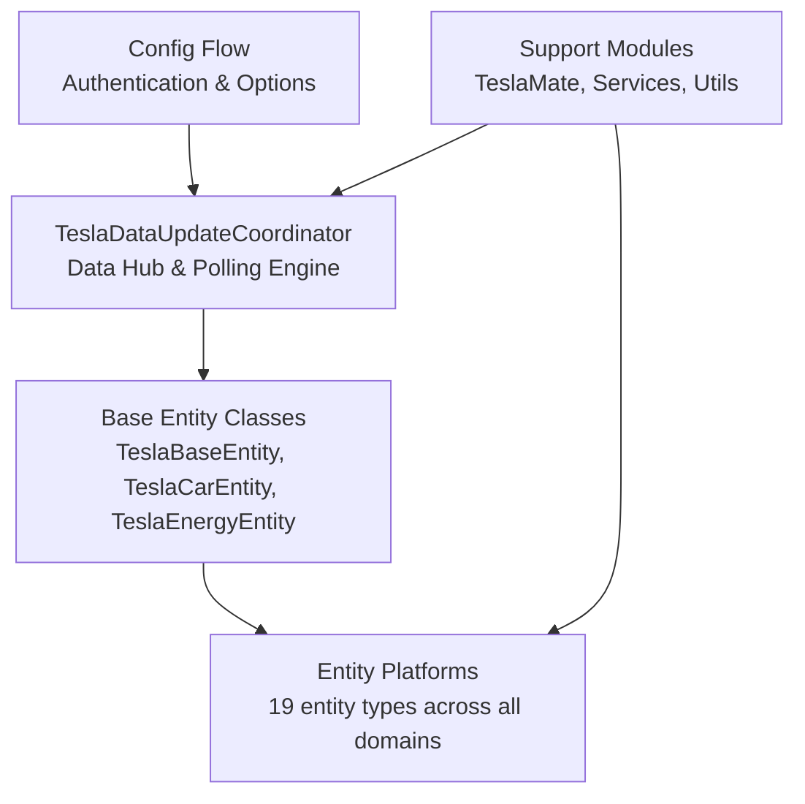

# Tesla Custom Integration - Components

## Core Components Overview



---

## 1. Core Coordinator: TeslaDataUpdateCoordinator

**File**: `custom_components/tesla_custom/__init__.py`  
**Class**: `TeslaDataUpdateCoordinator`  
**Base**: `DataUpdateCoordinator` (Home Assistant)  
**Responsibility**: Central hub for all data fetching, caching, and distribution

### Key Responsibilities

1. **API Client Management**
   - Initialize and maintain Tesla API client (from teslajsonpy)
   - Handle OAuth token refresh
   - Persist tokens to Home Assistant storage

2. **Data Fetching & Caching**
   - Poll all vehicles and energy sites at configured interval (default: 660 seconds)
   - Cache latest state to avoid redundant API calls
   - Track vehicle sleep state and wake-up status

3. **Update Distribution**
   - Notify all subscribed entities of state changes
   - Implement debouncing to avoid rapid re-updates
   - Provide `async_update_listeners_debounced()` hook

4. **Error Handling**
   - Implement exponential backoff on API failures
   - Handle token refresh on auth errors
   - Log errors for debugging

5. **Vehicle/Site Discovery**
   - Fetch list of associated vehicles on setup
   - Fetch list of energy sites (Powerwall)
   - Create Home Assistant devices and entities

### Key Methods

| Method                               | Purpose                                             |
| ------------------------------------ | --------------------------------------------------- |
| `_async_update_data()`               | Fetch latest vehicle and site states from Tesla API |
| `_async_update_vehicles()`           | Get all vehicles' current state                     |
| `async_update_listeners_debounced()` | Notify listening entities after debounce            |
| `async_remove_config_entry_device()` | Handle device removal from registry                 |
| `_async_close_client()`              | Cleanup API client on shutdown                      |
| `_async_save_tokens()`               | Persist OAuth tokens to storage                     |

### Data State Structure

```python
# Coordinator maintains cached state:
coordinator.data = {
    "vehicles": [
        {
            "id": "vehicle_id",
            "state": "online",  # or "asleep"
            "response": {  # Latest API response
                "id": ...,
                "state": ...,
                "charge_state": {...},
                "climate_state": {...},
                # ... all vehicle properties
            }
        },
        # ... more vehicles
    ],
    "energy_sites": [
        {
            "id": "site_id",
            "response": {  # Latest API response
                "id": ...,
                "battery_list": [...],
                "components": {...},
                # ... all site properties
            }
        },
        # ... more sites
    ]
}
```

---

## 2. Base Entity Classes

**File**: `custom_components/tesla_custom/base.py`

### Class Hierarchy

```
TeslaBaseEntity (Common functionality)
├── TeslaCarEntity (Vehicle-specific)
└── TeslaEnergyEntity (Energy site-specific)
```

### TeslaBaseEntity

**Base**: Home Assistant entity framework  
**Responsibility**: Common functionality for all Tesla entities

**Key Properties**:

- `coordinator` - Reference to TeslaDataUpdateCoordinator
- `device_identifier()` - Helper to create unique device IDs
- `assumed_state` - Whether entity can't directly sense state

**Key Methods**:

- `_handle_coordinator_update()` - Called when coordinator updates
- `async_added_to_hass()` - Register listener when entity added
- `async_will_remove_from_hass()` - Cleanup on removal

### TeslaCarEntity

**Extends**: `TeslaBaseEntity`  
**Responsibility**: Vehicle-specific functionality

**Key Properties**:

- `vehicle` - The vehicle object from coordinator data
- `vin` - Vehicle VIN (unique identifier)
- `car_name` - User-friendly vehicle name
- `device_info` - Device registration info

**Usage**: All vehicle-related entities inherit from this

**Example Subclasses**:

- `TeslaCarClimate` - Climate entity for HVAC control
- `TeslaCarBattery` - Battery level sensor
- `TeslaCarCharger` - Charger control switch

### TeslaEnergyEntity

**Extends**: `TeslaBaseEntity`  
**Responsibility**: Energy site-specific functionality

**Key Properties**:

- `site` - The energy site object from coordinator data
- `site_id` - Energy site identifier
- `site_name` - User-friendly site name

**Usage**: All Powerwall/energy-related entities inherit from this

**Example Subclasses**:

- `TeslaEnergyBattery` - Battery level sensor
- `TeslaEnergyGridStatus` - Grid connection status
- `TeslaEnergyOperationMode` - Site operation mode selector

---

## 3. Entity Platforms (Domain Modules)

### Entity Type Distribution

```
Sensors (668 LOC)              18 classes
├── Vehicle: Battery, Range, Charger, Temperature, etc.
└── Site: Power, Battery, Backup Reserve

Binary Sensors (300 LOC)       12 classes
├── Vehicle: Charging, Online, Doors, Windows
└── Site: Grid Status, Battery Charging

Switches (189 LOC)             5 classes
├── Charger, Sentry Mode, Polling, Valet Mode
└── Heated Steering Wheel

Climate (173 LOC)              1 class
└── HVAC control, temperature, presets

Covers (209 LOC)               5 classes
└── Frunk, Trunk, Windows, Sunroof, Charger Door

Buttons (153 LOC)              7 classes
└── Horn, Flash Lights, Wake Up, HomeLink, etc.

Locks (78 LOC)                 2 classes
└── Door Locks, Charge Port Latch

Selects (460 LOC)              6 classes
├── Vehicle: Seat Heaters, Overheat Protection
└── Site: Operation Mode, Export Rule, Grid Charging

Numbers (151 LOC)              3 classes
├── Charge Limit, Charging Amps
└── Backup Reserve

Device Tracker (91 LOC)        2 classes
└── Car Location, Route Destination

Update (130 LOC)               1 class
└── Software Version Status

Text (66 LOC)                  1 class
└── TeslaMate ID Configuration
```

### Sensor Platform (`sensor.py`)

**Implements**: Numeric and text state values

**Key Classes**:

- `TeslaCarBattery` - Battery percentage
- `TeslaCarRange` - Estimated range
- `TeslaCarChargerPower` - Current charging power
- `TeslaCarChargerRate` - Charging rate (km/hour)
- `TeslaCarTemp` - Inside/outside temperature
- `TeslaCarOdometer` - Total miles/km driven
- `TeslaCarArrivalTime` - Route arrival time
- `TeslaEnergyBattery` - Powerwall battery level
- `TeslaEnergyPowerSensor` - Solar/grid/load power

**Pattern**:

```python
class TeslaSensorClass(TeslaCarEntity, SensorEntity):
    @property
    def native_value(self):
        # Extract value from coordinator data
        return self.vehicle["response"]["..."]["value"]

    @property
    def native_unit_of_measurement(self):
        return UnitOfXXX.UNIT

    @property
    def device_class(self):
        return SensorDeviceClass.XXX

    @property
    def icon(self):
        return "mdi:icon-name"
```

### Binary Sensor Platform (`binary_sensor.py`)

**Implements**: On/off state indicators

**Key Classes**:

- `TeslaCarOnline` - Vehicle online status
- `TeslaCarAsleep` - Vehicle sleep state
- `TeslaCarCharging` - Actively charging
- `TeslaCarChargerConnection` - Charger physically connected
- `TeslaCarDoors` - Door open/closed
- `TeslaCarWindows` - Window open/closed
- `TeslaEnergyGridStatus` - Grid connected/disconnected

**Pattern**:

```python
class TeslaBinarySensorClass(TeslaCarEntity, BinarySensorEntity):
    @property
    def is_on(self):
        # Return boolean state
        return self.vehicle["response"]["..."]["bool_value"]

    @property
    def device_class(self):
        return BinarySensorDeviceClass.XXX
```

### Switch Platform (`switch.py`)

**Implements**: Toggle controls

**Key Classes**:

- `TeslaCarCharger` - Toggle charger on/off
- `TeslaCarSentryMode` - Toggle sentry mode
- `TeslaCarPolling` - Toggle polling on/off
- `TeslaCarValetMode` - Toggle valet mode
- `TeslaCarHeatedSteeringWheel` - Toggle heated steering

**Pattern**:

```python
class TeslaSwitchClass(TeslaCarEntity, SwitchEntity):
    async def async_turn_on(self, **kwargs):
        await self.coordinator.api.vehicle_command(...)
        await self.coordinator.async_request_refresh()

    async def async_turn_off(self, **kwargs):
        await self.coordinator.api.vehicle_command(...)
        await self.coordinator.async_request_refresh()

    @property
    def is_on(self):
        return self.vehicle["response"]["..."]["bool_value"]
```

### Climate Platform (`climate.py`)

**Implements**: HVAC temperature and mode control

**Key Class**: `TeslaCarClimate`

**Capabilities**:

- Set target temperature
- Set HVAC mode (heat, cool, auto, off)
- Set fan mode (auto, low, medium, high)
- Preset modes (defrost, keep on, dog mode, camp mode)

**Pattern**:

```python
class TeslaCarClimate(TeslaCarEntity, ClimateEntity):
    async def async_set_temperature(self, **kwargs):
        await self.coordinator.api.set_climate_temperature(...)

    async def async_set_hvac_mode(self, hvac_mode):
        await self.coordinator.api.set_climate_mode(...)

    async def async_set_fan_mode(self, fan_mode):
        await self.coordinator.api.set_climate_fan(...)

    async def async_set_preset_mode(self, preset_mode):
        await self.coordinator.api.set_climate_preset(...)
```

### Cover Platform (`cover.py`)

**Implements**: Openable/closable elements

**Key Classes**:

- `TeslaCarFrunk` - Front trunk
- `TeslaCarTrunk` - Rear trunk
- `TeslaCarWindows` - Windows
- `TeslaCarSunRoof` - Sunroof
- `TeslaCarChargerDoor` - Charging door

**Pattern**:

```python
class TeslaCoverClass(TeslaCarEntity, CoverEntity):
    async def async_open_cover(self, **kwargs):
        await self.coordinator.api.open_element(...)

    async def async_close_cover(self, **kwargs):
        await self.coordinator.api.close_element(...)

    @property
    def is_closed(self):
        return self.vehicle["response"]["..."]["is_closed"]
```

### Button Platform (`button.py`)

**Implements**: One-time action triggers

**Key Classes**:

- `TeslaCarHorn` - Sound horn
- `TeslaCarFlashLights` - Flash lights
- `TeslaCarWakeUp` - Wake sleeping vehicle
- `TeslaCarTriggerHomelink` - Trigger garage door
- `TeslaCarRemoteStart` - Start engine (vehicles with feature)
- `TeslaCarForceDataUpdate` - Force data refresh

**Pattern**:

```python
class TeslaButtonClass(TeslaCarEntity, ButtonEntity):
    async def async_press(self) -> None:
        await self.coordinator.api.vehicle_command(...)
        await self.coordinator.async_request_refresh()
```

### Lock Platform (`lock.py`)

**Implements**: Lock/unlock controls

**Key Classes**:

- `TeslaCarDoors` - Door lock
- `TeslaCarChargePortLatch` - Charge port lock

**Pattern**:

```python
class TeslaLockClass(TeslaCarEntity, LockEntity):
    async def async_lock(self, **kwargs):
        await self.coordinator.api.lock_doors(...)

    async def async_unlock(self, **kwargs):
        await self.coordinator.api.unlock_doors(...)

    @property
    def is_locked(self):
        return self.vehicle["response"]["..."]["is_locked"]
```

### Select Platform (`select.py`)

**Implements**: Option selection

**Key Classes**:

- `TeslaCarHeatedSeat` - Seat heater level selection
- `TeslaCarHeatedSteeringWheel` - Steering wheel heater level
- `TeslaCarCabinOverheatProtection` - Overheat protection mode
- `TeslaEnergyOperationMode` - Site operation mode
- `TeslaEnergyExportRule` - Energy export rule
- `TeslaEnergyGridCharging` - Grid charging mode

**Pattern**:

```python
class TeslaSelectClass(TeslaCarEntity, SelectEntity):
    @property
    def current_option(self):
        return self.vehicle["response"]["..."]["current_option"]

    @property
    def options(self):
        return ["option1", "option2", "option3"]

    async def async_select_option(self, option: str):
        await self.coordinator.api.set_option(option)
```

### Number Platform (`number.py`)

**Implements**: Numeric value controls

**Key Classes**:

- `TeslaCarChargeLimit` - Set charge limit percentage
- `TeslaCarChargingAmps` - Set charging amps
- `TeslaEnergyBackupReserve` - Set Powerwall reserve level

**Pattern**:

```python
class TeslaNumberClass(TeslaCarEntity, NumberEntity):
    @property
    def native_value(self):
        return self.vehicle["response"]["..."]["numeric_value"]

    @property
    def native_min_value(self):
        return 0

    @property
    def native_max_value(self):
        return 100

    async def async_set_native_value(self, value: float):
        await self.coordinator.api.set_value(value)
```

### Device Tracker Platform (`device_tracker.py`)

**Implements**: Location and navigation tracking

**Key Classes**:

- `TeslaCarLocation` - Current vehicle location (lat/lon)
- `TeslaCarDestinationLocation` - Active route destination

**Pattern**:

```python
class TeslaLocationClass(TeslaCarEntity, TrackerEntity):
    @property
    def latitude(self):
        return self.vehicle["response"]["drive_state"]["latitude"]

    @property
    def longitude(self):
        return self.vehicle["response"]["drive_state"]["longitude"]

    @property
    def source_type(self):
        return SourceType.GPS
```

### Update Platform (`update.py`)

**Implements**: Software version tracking

**Key Class**: `TeslaCarUpdate`

**Capabilities**:

- Track available software updates
- Show update status (available, scheduled, downloading, installing)
- Trigger update installation

### Text Platform (`text.py`)

**Implements**: Text configuration

**Key Class**: `TeslaCarTeslaMateID`

**Purpose**: Store/retrieve TeslaMate integration identifier

---

## 4. Configuration System

**File**: `custom_components/tesla_custom/config_flow.py`  
**Classes**: `TeslaConfigFlow`, `OptionsFlowHandler`

### TeslaConfigFlow

**Purpose**: Handles user authentication and config entry creation

**Flow Steps**:

1. `async_step_user()` - Initial form requesting Tesla token
2. `async_step_credentials()` - Alternative token input method
3. `async_step_reauth()` - Reauthenticate if token expires
4. `async_step_import()` - Legacy config import

**Validation**:

- `validate_input()` - Test token with Tesla API
- Prevents duplicate entries for same account
- Stores tokens securely in Home Assistant

### OptionsFlowHandler

**Purpose**: Configure integration options after setup

**Options**:

- `polling_interval` - Seconds between updates (default: 660)
- `wake_on_start` - Wake sleeping cars on HA startup
- `polling_policy` - When to allow cars to sleep
- `teslamate_enabled` - Enable TeslaMate sync

---

## 5. Support Modules

### TeslaMate Integration (`teslamate.py`)

**Class**: `TeslaMate`  
**Purpose**: Sync data from TeslaMate via MQTT as alternative to polling

**Key Methods**:

- `enable()` - Start MQTT listening
- `watch_cars()` - Subscribe to vehicle topics
- `async_handle_new_data()` - Process incoming MQTT messages
- `update_car_state()` - Update coordinator with new data

**Benefits**:

- Real-time updates without polling
- Reduced battery drain
- Works alongside cloud polling

### Services (`services.py`)

**Purpose**: Custom services for Home Assistant automations

**Services**:

- `set_update_interval` - Change polling interval at runtime
- `async_call_tesla_service` - Generic Tesla API command wrapper

**Usage**:

```yaml
service: tesla_custom.set_update_interval
data:
  config_entry_id: "..."
  interval: 300
```

### Utilities (`util.py`)

**Purpose**: Helper functions

**Functions**:

- `create_tesla_ssl_context()` - Create SSL context for API requests

---

## Component Responsibility Matrix

| Component     | Setup | Config | Polling | Dispatch | Commands |
| ------------- | ----- | ------ | ------- | -------- | -------- |
| Coordinator   | ✓     | ✓      | ✓       | ✓        | ✓        |
| Base Entities | ✓     | ✓      | -       | ✓        | -        |
| Platforms     | ✓     | -      | -       | -        | ✓        |
| Config Flow   | -     | ✓      | -       | -        | -        |
| TeslaMate     | -     | -      | ✓       | ✓        | -        |
| Services      | -     | -      | -       | -        | ✓        |

---

**Summary**: The component architecture cleanly separates data coordination (TeslaDataUpdateCoordinator), configuration (ConfigFlow), entity types (platform modules), and support integrations, following Home Assistant patterns and Python best practices.
