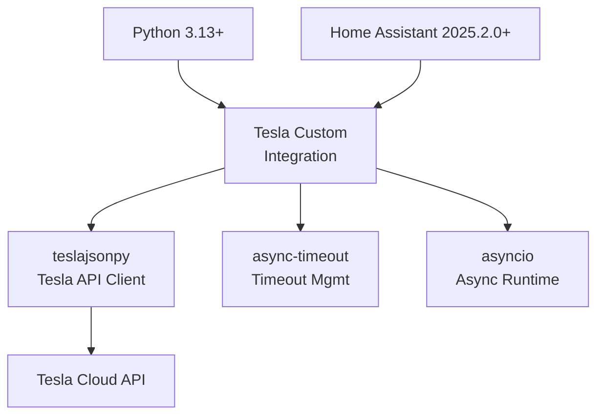
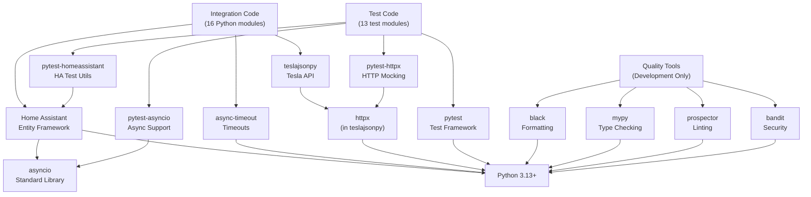

# Tesla Custom Integration - Dependencies

## Project Dependencies Overview



---

## 1. Runtime Dependencies

### Core Dependencies

#### Home Assistant Framework

**Package**: `homeassistant`  
**Version**: `>=2025.2.0`  
**Source**: PyPI  
**Purpose**: Entity framework, config system, state machine

**Key Imports**:

```python
from homeassistant.core import HomeAssistant, callback
from homeassistant.config_entries import ConfigEntry, ConfigFlowContext
from homeassistant.helpers.entity import Entity, CoordinatorEntity
from homeassistant.helpers.entity_platform import AddEntitiesCallback
from homeassistant.components.sensor import SensorEntity, SensorDeviceClass
from homeassistant.components.binary_sensor import BinarySensorEntity
from homeassistant.components.switch import SwitchEntity
from homeassistant.components.climate import ClimateEntity
from homeassistant.components.cover import CoverEntity
from homeassistant.components.button import ButtonEntity
from homeassistant.components.lock import LockEntity
from homeassistant.components.select import SelectEntity
from homeassistant.components.number import NumberEntity
from homeassistant.components.device_tracker import TrackerEntity
from homeassistant.components.update import UpdateEntity
from homeassistant.components.text import TextEntity
from homeassistant.helpers.update_coordinator import DataUpdateCoordinator
```

**Framework Concepts**:

- **Entity Registry**: Tracks all entities and their unique IDs
- **Device Registry**: Tracks devices and their relationships
- **State Machine**: Stores and retrieves entity state
- **Config Entries**: Manages integration configuration
- **Services**: Custom command handlers
- **Data Coordinators**: Centralized update management

#### teslajsonpy (Custom Fork)

**Package**: `teslajsonpy`  
**Version**: Dev branch  
**Source**: `git+https://github.com/grzesiek1711/teslajsonpy.git@dev`  
**Purpose**: Tesla API client library

**Key Classes**:

```python
from teslajsonpy import TeslaAPI
from teslajsonpy.exceptions import (
    TeslaException,
    Unauthorized,
    RequestException,
)
```

**Main Functionality**:

- OAuth 2.0 authentication
- Vehicle/site data fetching
- Command execution (lock, climate, etc.)
- Error handling and retry logic

**API Methods**:

```python
# Authentication
api.authenticate(refresh_token)

# Vehicles
vehicles = await api.get_vehicles()
vehicle = await api.get_vehicle(vehicle_id)

# Energy Sites
sites = await api.get_energy_sites()
site = await api.get_energy_site(site_id)

# Commands
await vehicle.lock_doors()
await vehicle.unlock_doors()
await vehicle.start_climate()
await vehicle.set_climate_temperature(temp)
```

**Why Custom Fork**:

- Official library doesn't support some commands
- Fork includes additional features and fixes
- Maintained by community for this integration

#### async-timeout

**Package**: `async-timeout`  
**Version**: `>=4.0.0`  
**Source**: PyPI  
**Purpose**: Timeout management for async operations

**Usage**:

```python
import asyncio
from async_timeout import timeout

async def fetch_with_timeout():
    try:
        async with timeout(30):  # 30 second timeout
            result = await api_call()
    except asyncio.TimeoutError:
        # Handle timeout
```

**Why Needed**:

- Tesla API sometimes slow or unresponsive
- Prevents hanging coroutines
- Enables graceful timeout handling

### Python Standard Library

**Key Modules Used**:

- `asyncio` - Async/await support
- `datetime` - Timestamps and scheduling
- `logging` - Logging throughout
- `json` - JSON parsing and serialization
- `typing` - Type hints
- `collections` - Data structures
- `functools` - Decorators and utilities

---

## 2. Development Dependencies

### Testing Framework

#### pytest

**Version**: `>=7.2`  
**Purpose**: Test execution and discovery

**Configuration** (`pyproject.toml`):

```toml
[tool.pytest.ini_options]
minversion = "7.2"
addopts = "-ra -q"
testpaths = ["tests"]
asyncio_mode = "auto"
```

#### pytest-homeassistant-custom-component

**Version**: `>=0.13.107`  
**Purpose**: Home Assistant testing utilities

**Key Fixtures**:

```python
@pytest.fixture
async def hass():
    """Home Assistant instance for testing"""

@pytest.fixture
def mock_config_entry():
    """Mock config entry"""

@pytest.fixture
async def mock_coordinator(hass):
    """Mock coordinator for entity testing"""
```

#### pytest-asyncio

**Version**: `>=0.20.3`  
**Purpose**: Async test support

**Usage**:

```python
@pytest.mark.asyncio
async def test_async_function():
    result = await some_async_call()
    assert result
```

#### pytest-httpx

**Version**: `>=0.24.0`  
**Purpose**: HTTP mocking for API calls

**Usage**:

```python
@pytest.fixture
def mock_aiohttp(monkeypatch):
    """Mock HTTP responses"""
    # Mock Tesla API responses
```

### Code Quality & Analysis

#### black

**Version**: `>=21.12b0`  
**Purpose**: Code formatting

**Configuration** (`pyproject.toml`):

```toml
[tool.black]
line-length = 88
target-version = ['py313']
```

**Usage**:

```bash
black .  # Format all Python files
```

#### mypy

**Version**: `>=0.812`  
**Purpose**: Static type checking

**Usage**:

```bash
mypy .  # Check type hints
```

**Example**:

```python
# mypy catches this error:
def process(value: int) -> str:
    return value  # Error: incompatible return type
```

#### prospector

**Version**: `>=1.3.1` (with_all extras)  
**Purpose**: Comprehensive code analysis

**Configuration** (`.prospector.yml`):

- Pylint rules
- PEP8 compliance
- Code complexity checks
- Security checks

**Usage**:

```bash
prospector  # Run all checks
```

#### bandit

**Version**: `>=1.7.0`  
**Purpose**: Security vulnerability scanning

**Checks**:

- Insecure random usage
- SQL injection vulnerabilities
- Hardcoded credentials
- Unsafe deserialization

#### pydocstyle

**Version**: `>=6.0.0`  
**Purpose**: Docstring compliance

**Checks**:

- Docstring presence
- Docstring format
- PEP 257 compliance

### Pre-commit Hooks

#### pre-commit

**Version**: `>=2.11.1`  
**Configuration** (`.pre-commit-config.yaml`)

**Hooks** (run on commit):

```yaml
- black # Format code
- mypy # Type checking
- prospector # Linting
- bandit # Security
```

**Usage**:

```bash
pre-commit install  # Setup hooks
pre-commit run --all-files  # Run manually
```

---

## 3. Dependency Relationship Graph



---

## 4. Dependency Specifications

### pyproject.toml

```toml
[tool.poetry.dependencies]
python = "^3.13.2"
teslajsonpy = { git = "https://github.com/grzesiek1711/teslajsonpy.git", branch = "dev" }
async-timeout = ">=4.0.0"

[tool.poetry.group.dev.dependencies]
homeassistant = ">=2025.2.0"
pytest-homeassistant-custom-component = ">=0.13.107"
bandit = ">=1.7.0"
black = { version = ">=21.12b0", allow-prereleases = true }
mypy = ">=0.812"
pre-commit = ">=2.11.1"
pydocstyle = ">=6.0.0"
prospector = { extras = ["with_all"], version = ">=1.3.1" }
aiohttp_cors = ">=0.7.0"
pytest-asyncio = ">=0.20.3"
pytest-httpx = ">=0.24.0"
```

### manifest.json (Home Assistant)

```json
{
  "domain": "tesla_custom",
  "name": "Tesla Custom Integration",
  "dependencies": ["http"],
  "requirements": ["git+https://github.com/grzesiek1711/teslajsonpy.git@dev"],
  "homeassistant": "2024.11.0",
  "version": "3.26.3"
}
```

---

## 5. External API Dependencies

### Tesla Cloud API

**Endpoint**: `https://owner-api.teslamotors.com`  
**Authentication**: OAuth 2.0 with refresh tokens  
**Rate Limits**: Varies by endpoint  
**Timeout**: Typically 30 seconds

**Endpoints Used** (via teslajsonpy):

```
GET  /api/1/vehicles                    # List vehicles
GET  /api/1/vehicles/{id}/data          # Get vehicle state
GET  /api/1/energy_sites                # List energy sites
GET  /api/1/energy_sites/{id}/data      # Get site state
POST /api/1/vehicles/{id}/command/...   # Execute commands
```

### Tesla Fleet API (Optional)

**Used When**: Some newer vehicles require Fleet API with proxy  
**Requires**: Tesla HTTP Proxy addon (separate setup)  
**Configuration**: Set proxy URL in integration options

---

## 6. Optional Integrations

### MQTT (Optional)

**Used For**: TeslaMate data sync  
**Enabled**: Via `teslamate_enabled` option  
**Dependency**: Home Assistant MQTT integration

**Topics Subscribed To**:

```
teslamate/cars/{car_id}/*
```

### HTTP (Required)

**Used For**: Tesla API communication  
**Dependency**: Home Assistant HTTP component  
**Configuration**: Automatic (no user config needed)

---

## 7. Version Compatibility Matrix

| Component      | Min Version | Max Version | Status     |
| -------------- | ----------- | ----------- | ---------- |
| Python         | 3.13.2      | 3.14+       | Supported  |
| Home Assistant | 2025.2.0    | Latest      | Supported  |
| teslajsonpy    | dev branch  | dev branch  | Custom     |
| async-timeout  | 4.0.0       | 4.1+        | Compatible |

---

## 8. Dependency Installation

### Production Installation

```bash
# Install via pip (Home Assistant auto-installs)
pip install teslajsonpy async-timeout

# Or use poetry
poetry install --only main
```

### Development Installation

```bash
# Install all dependencies
poetry install

# Or with pip
pip install -e .[dev]
```

### Docker Installation

Home Assistant Docker includes all dependencies automatically.

---

## 9. Known Dependency Issues

### teslajsonpy Fork Requirement

**Issue**: Official teslajsonpy missing features  
**Solution**: Using custom fork with additional features  
**Maintenance**: Fork maintainer active (grzesiek1711)

### Python 3.13 Requirement

**Issue**: Some older systems still on Python 3.11/3.12  
**Solution**: Requires Home Assistant 2025.2.0 or later  
**Workaround**: Upgrade Home Assistant first

### async-timeout 4.0+

**Issue**: API changed in 4.0 from earlier versions  
**Solution**: Pinned to >=4.0.0  
**Upgrade**: Required if running older async-timeout

---

## 10. Dependency Security

### Security Updates

**Monitoring**:

- Dependabot alerts on GitHub
- Security advisories checked regularly
- CVE databases monitored

**Process**:

1. Security issue detected
2. Update dependency version
3. Run security tests
4. Release patch version

### Trusted Sources

**PyPI Packages**:

- Home Assistant: Official Home Assistant project
- async-timeout: Python Software Foundation
- pytest: Python testing community

**Git Sources**:

- teslajsonpy fork: Community maintained, code reviewed

---

## 11. Dependency Troubleshooting

### Installation Issues

**Problem**: `teslajsonpy` fork fails to install  
**Solution**:

```bash
# Ensure git is installed
git --version

# Upgrade pip
pip install --upgrade pip

# Try again
poetry install
```

**Problem**: Type checking failures with mypy  
**Solution**:

```bash
# Regenerate type stubs
pip install types-...
mypy --install-types
```

### Version Conflicts

**Problem**: "Incompatible Home Assistant version"  
**Solution**: Upgrade Home Assistant before installing integration

**Problem**: asyncio compatibility issues  
**Solution**: Ensure Python 3.13+ and async-timeout 4.0+

---

## Summary of Dependency Layers

| Layer         | Dependency              | Purpose                 | Version   |
| ------------- | ----------------------- | ----------------------- | --------- |
| **Core**      | Python                  | Runtime                 | 3.13.2+   |
| **Framework** | Home Assistant          | Entity/Config framework | 2025.2.0+ |
| **API**       | teslajsonpy             | Tesla API client        | dev       |
| **Async**     | async-timeout           | Timeouts                | 4.0.0+    |
| **Testing**   | pytest ecosystem        | Test execution          | 7.2+      |
| **Quality**   | black, mypy, prospector | Code analysis           | Various   |

---

**Key Principle**: Minimal core dependencies, comprehensive development tooling, async-first architecture, and Home Assistant-tight integration.
