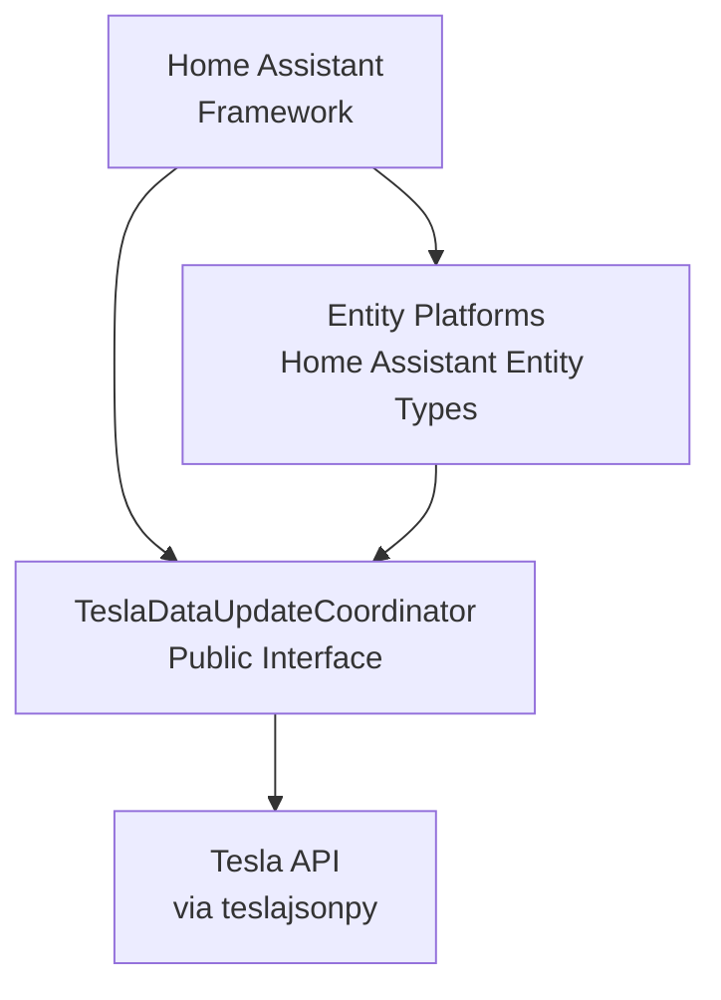

# Tesla Custom Integration - Interfaces & APIs

## Interface Overview



---

## 1. TeslaDataUpdateCoordinator Public Interface

**File**: `custom_components/tesla_custom/__init__.py`

### Data Structure

```python
coordinator.data: Dict = {
    "vehicles": List[Dict],  # All associated vehicles
    "energy_sites": List[Dict],  # All Powerwall sites
    "last_update": datetime,
}

# Vehicle entry structure
{
    "id": str,  # Vehicle ID
    "vin": str,  # Vehicle VIN
    "state": str,  # "online" or "asleep"
    "response": Dict,  # Latest Tesla API response
}

# Energy site entry structure
{
    "id": str,  # Site ID
    "response": Dict,  # Latest Tesla API response
}
```

### Public Properties

| Property              | Type       | Purpose                                |
| --------------------- | ---------- | -------------------------------------- |
| `data`                | dict       | Cached state of all vehicles and sites |
| `api`                 | `TeslaAPI` | Tesla API client from teslajsonpy      |
| `last_update_success` | bool       | Whether last update succeeded          |

### Public Methods

#### `async_request_refresh()`

**Purpose**: Request immediate update of data

**Signature**:

```python
async def async_request_refresh() -> None
```

**Usage**: Called by entity actions (lock, climate, etc.) to fetch latest state

**Example**:

```python
async def async_lock(self):
    await self.coordinator.api.lock_doors()
    await self.coordinator.async_request_refresh()
```

#### `async_update_listeners_debounced()`

**Purpose**: Notify listening entities of updates with debouncing

**Signature**:

```python
async def async_update_listeners_debounced() -> None
```

**Behavior**:

- Called internally after data update
- Debounces rapid multiple calls (default: 5 second window)
- Triggers `_handle_coordinator_update()` on all listeners

#### `async_remove_config_entry_device()`

**Purpose**: Handle device removal from entity registry

**Signature**:

```python
async def async_remove_config_entry_device(
    config_entry: ConfigEntry,
    device_entry: DeviceEntry,
) -> bool
```

**Returns**: True if device can be removed, False if protected

**Behavior**:

- Checks if device is actively used
- Prevents removal of live vehicles/sites
- Allows removal of orphaned devices

### Internal Methods (Advanced)

#### `_async_update_data()`

**Purpose**: Main update loop - fetches all vehicle/site data

**Called by**: DataUpdateCoordinator polling loop

**Process**:

1. Check if token refresh needed
2. Fetch all vehicles via `api.get_vehicles()`
3. Fetch all energy sites via `api.get_energy_sites()`
4. Cache latest responses
5. Return data dict

**Error Handling**:

- Logs errors
- Implements exponential backoff
- Continues with cached data on failure

#### `_async_update_vehicles()`

**Purpose**: Fetch current state of all vehicles

**Returns**: List of vehicle data dicts

**Logic**:

- For each vehicle, fetch full state via `api.get_vehicle()`
- Track sleep state
- Handle wake-up delay

#### `_async_save_tokens()`

**Purpose**: Persist OAuth tokens to Home Assistant storage

**Called after**: Token refresh or initial authentication

#### `_async_close_client()`

**Purpose**: Clean up API client on shutdown

**Called by**: `async_unload_entry()`

---

## 2. Entity Base Class Interfaces

**File**: `custom_components/tesla_custom/base.py`

### TeslaBaseEntity Interface

**Extends**: `CoordinatorEntity` from Home Assistant

**Properties** (must implement or inherit):

```python
# From Home Assistant entity framework
@property
def name(self) -> str:
    """Return entity name"""

@property
def unique_id(self) -> str:
    """Return unique identifier for entity"""

@property
def entity_description(self) -> EntityDescription:
    """Return entity metadata"""

# Tesla-specific
@property
def coordinator(self) -> TeslaDataUpdateCoordinator:
    """Return the data coordinator"""

@property
def should_poll(self) -> bool:
    """Don't poll, coordinator handles updates"""
    return False
```

**Methods** (may override):

```python
async def _handle_coordinator_update(self) -> None:
    """Handle updates from coordinator"""
    # Called when coordinator data changes
    # Default: trigger state write
    self.async_write_ha_state()

async def async_added_to_hass(self) -> None:
    """Register listener when entity added to HA"""

async def async_will_remove_from_hass(self) -> None:
    """Unregister listener when entity removed"""
```

**Static Methods**:

```python
@staticmethod
def device_identifier(
    coordinator: TeslaDataUpdateCoordinator,
    vehicle_or_site_id: str,
    entity_type: str
) -> tuple:
    """Generate unique device identifier"""
    # Returns: (domain, vehicle_id, entity_type)
```

### TeslaCarEntity Interface

**Extends**: `TeslaBaseEntity`

**Properties** (provided by base):

```python
@property
def vehicle(self) -> Dict:
    """Return vehicle data from coordinator"""
    # Access: self.vehicle["response"]["..."]

@property
def vin(self) -> str:
    """Return vehicle VIN"""

@property
def car_name(self) -> str:
    """Return user-friendly car name"""

@property
def update_controller(self):
    """Return update controller (for TeslaMate)"""

@property
def device_info(self) -> DeviceInfo:
    """Return device registration info"""
    return DeviceInfo(
        identifiers={(DOMAIN, self.vin)},
        manufacturer="Tesla",
        model=...,
        name=self.car_name,
    )
```

**Usage Pattern**:

```python
class TeslaCarSensorExample(TeslaCarEntity, SensorEntity):
    @property
    def native_value(self):
        return self.vehicle["response"]["charge_state"]["battery_level"]
```

### TeslaEnergyEntity Interface

**Extends**: `TeslaBaseEntity`

**Properties** (provided by base):

```python
@property
def site(self) -> Dict:
    """Return energy site data from coordinator"""

@property
def site_id(self) -> str:
    """Return energy site ID"""

@property
def site_name(self) -> str:
    """Return user-friendly site name"""

@property
def device_info(self) -> DeviceInfo:
    """Return device registration info"""
```

**Usage Pattern**:

```python
class TeslaEnergySensorExample(TeslaEnergyEntity, SensorEntity):
    @property
    def native_value(self):
        return self.site["response"]["components"]["battery"]["charge"]
```

---

## 3. Entity Platform Setup Interface

**Pattern**: Each entity platform module implements `async_setup_entry()`

### Signature

```python
async def async_setup_entry(
    hass: HomeAssistant,
    config_entry: ConfigEntry,
    async_add_entities: AddEntitiesCallback,
    discovery_info: DiscoveryInfoType | None = None,
) -> None:
```

### Implementation Pattern

```python
async def async_setup_entry(hass, config_entry, async_add_entities, discovery_info):
    # Get coordinator from home assistant data
    coordinator = hass.data[DOMAIN][config_entry.entry_id]["coordinator"]

    entities = []

    # Create vehicle entities
    for vehicle_id, vehicle_data in coordinator.data["vehicles"].items():
        entities.append(TeslaCarSensorClass(coordinator, vehicle_id, ...))

    # Create energy site entities
    for site_id, site_data in coordinator.data["energy_sites"].items():
        entities.append(TeslaEnergySensorClass(coordinator, site_id, ...))

    # Register with Home Assistant
    async_add_entities(entities)
```

---

## 4. Configuration Flow Interface

**File**: `custom_components/tesla_custom/config_flow.py`

### TeslaConfigFlow Interface

**Extends**: `ConfigFlow` from Home Assistant

**Methods** (must implement or inherit):

```python
async def async_step_user(user_input=None):
    """Handle initial user config"""
    # Returns: self.async_show_form(...) or self.async_create_entry(...)

async def async_step_reauth(user_input=None):
    """Handle token refresh on expiration"""

async def async_get_options_flow(config_entry):
    """Return options flow handler"""
    return OptionsFlowHandler(config_entry)
```

### Options Flow Interface

```python
class OptionsFlowHandler:
    async def async_step_init(user_input=None):
        """Handle options configuration"""
        # Returns: self.async_create_entry(title="", data={...})
```

### Validation Interface

```python
def validate_input(hass: HomeAssistant, data: dict) -> dict:
    """Validate user input"""
    # Raise InvalidAuth or CannotConnect on failure
    # Returns: {"title": "Account Name"} on success
```

---

## 5. Tesla API Interface

**Source**: `teslajsonpy` library

### Main API Class: TeslaAPI

**Key Methods**:

```python
class TeslaAPI:
    async def authenticate(refresh_token: str) -> None:
        """Authenticate with Tesla OAuth"""

    async def get_vehicles() -> List[Vehicle]:
        """Get all vehicles"""

    async def get_vehicle(vehicle_id: str) -> Vehicle:
        """Get vehicle data"""

    async def get_energy_sites() -> List[EnergySite]:
        """Get all energy sites"""

    async def get_energy_site(site_id: str) -> EnergySite:
        """Get energy site data"""
```

### Vehicle Object Interface

```python
class Vehicle:
    id: str
    vin: str

    # State properties
    charging_state: str  # "Charging", "Complete", "Stopped", "Disconnected"
    online_state: str  # "online", "offline", "asleep"

    # Data accessors
    async def get_latest_vehicle_data() -> dict
    async def lock_doors() -> dict
    async def unlock_doors() -> dict
    async def set_climate_temperature(temp: float) -> dict
    async def start_climate() -> dict
    async def stop_climate() -> dict
    # ... and many more commands
```

### EnergySite Object Interface

```python
class EnergySite:
    id: str

    # Data accessors
    async def get_site_data() -> dict
    async def set_operation_mode(mode: str) -> dict
    # ... site commands
```

---

## 6. Home Assistant Event Bus & Service Interface

### Event Publishing

```python
hass.bus.async_fire(
    event_type="tesla_custom_vehicle_updated",
    event_data={"vehicle_id": vin}
)
```

### Service Registration

```python
hass.services.async_register(
    domain=DOMAIN,
    service="set_update_interval",
    service_func=async_set_update_interval,
    schema=SERVICE_SCHEMA,
)
```

### Service Handler Signature

```python
async def async_set_update_interval(call: ServiceCall) -> None:
    """Handle service call"""
    config_entry_id = call.data.get("config_entry_id")
    interval = call.data.get("interval")
    # Update coordinator polling interval
```

---

## 7. Data Type Interfaces

### Vehicle State Dictionary

```python
vehicle["response"] = {
    # Identity
    "id": int,
    "vin": str,
    "display_name": str,

    # State
    "state": str,  # "online", "asleep", etc

    # Charge state
    "charge_state": {
        "charging_state": str,
        "battery_level": int,  # 0-100
        "usable_battery_level": int,
        "charge_limit_soc": int,
        "charge_rate": float,
        "charger_power": int,
        "energy_added": float,
        # ... more fields
    },

    # Climate state
    "climate_state": {
        "inside_temp": float,
        "outside_temp": float,
        "target_temp": float,
        "is_climate_on": bool,
        "climate_keeper_mode": str,
        # ... more fields
    },

    # Vehicle state
    "vehicle_state": {
        "is_user_present": bool,
        "fd_window": int,  # 0=closed, >0=open
        "rd_window": int,
        "fp_window": int,
        "rp_window": int,
        "is_user_present": bool,
        "locked": bool,
        "charge_port_latch": str,  # "Engaged", "Disengaged"
        "odometer": float,
        # ... more fields
    },

    # Drive state
    "drive_state": {
        "latitude": float,
        "longitude": float,
        "active_route_destination": str,
        "active_route_energy_at_arrival": int,
        "active_route_miles_to_arrival": float,
        "active_route_minutes_to_arrival": int,
        "power": int,  # kW
        "shift_state": str,  # "D", "R", "N", "P"
        # ... more fields
    },

    # Other
    "software_update": {...},
    "tpms_pressure": {
        "fl": float,
        "fr": float,
        "rl": float,
        "rr": float,
    },
}
```

### Energy Site State Dictionary

```python
site["response"] = {
    # Identity
    "id": int,
    "site_name": str,

    # Battery state
    "battery_list": [
        {
            "energy_left": float,
            "energy_ref": float,
            "energy_max": float,
            # ... more fields
        }
    ],

    # Components & power
    "components": {
        "solar": {...},
        "battery": {...},
        "grid": {...},
        "load": {...},
    },

    # Operations
    "site_status": {
        "running": bool,
    },
}
```

---

## 8. TeslaMate Integration Interface

**File**: `custom_components/tesla_custom/teslamate.py`

### TeslaMate Class Interface

```python
class TeslaMate:
    async def enable() -> None:
        """Start MQTT listener"""

    async def watch_cars(vehicles: List[dict]) -> None:
        """Subscribe to vehicle topics"""

    async def get_car_from_id(car_id: str) -> str:
        """Get VIN from car ID"""

    async def unload() -> None:
        """Stop MQTT listener and cleanup"""
```

### MQTT Topics

**Topic Pattern**: `teslamate/cars/{car_id}/{metric}`

**Metrics Updated**:

- `state` - online/asleep
- `charge_state` - charging/complete/stopped/disconnected
- `latitude`, `longitude` - GPS location
- Battery, temperature, climate data
- And many more...

---

## 9. Service Interface

**File**: `custom_components/tesla_custom/services.py`

### Available Services

#### `tesla_custom.set_update_interval`

**Data Schema**:

```python
{
    vol.Required("config_entry_id"): str,
    vol.Required("interval"): vol.Range(min=60, max=3600),
}
```

**Effect**: Changes polling interval at runtime

**Example**:

```yaml
service: tesla_custom.set_update_interval
data:
  config_entry_id: "abc123"
  interval: 300
```

---

## Type Hints & Validation

### Common Type Hints

```python
from typing import Dict, List, Optional, Any
from dataclasses import dataclass
from homeassistant.core import HomeAssistant, callback
from homeassistant.config_entries import ConfigEntry

# Coordinator type
coordinator: TeslaDataUpdateCoordinator

# Vehicle/Site data
vehicle_data: Dict[str, Any]
site_data: Dict[str, Any]

# Entity types
entity: TeslaCarEntity | TeslaEnergyEntity
```

### Validation Examples

```python
# Config validation
vol.Required(CONF_TOKEN): cv.string
vol.Optional(CONF_POLLING_INTERVAL, default=660):
    vol.Range(min=60, max=3600)

# Service validation
SERVICE_SCHEMA = vol.Schema({
    vol.Required("config_entry_id"): cv.string,
    vol.Required("interval"): vol.Range(min=60, max=3600),
})
```

---

## Integration Points Summary

| System         | Interface        | Purpose                           |
| -------------- | ---------------- | --------------------------------- |
| Home Assistant | Entity Framework | Entity creation, state management |
| Home Assistant | Config Entry     | Configuration storage, lifecycle  |
| Home Assistant | Data Coordinator | Update synchronization            |
| Tesla API      | teslajsonpy      | Vehicle/site data and commands    |
| TeslaMate      | MQTT             | Real-time data sync               |
| Automation     | Services         | Runtime configuration changes     |

---

**Key Principle**: Interfaces are designed to be minimal and focused, following Home Assistant conventions and async patterns throughout.
