# Tesla Custom Integration - Workflows & Processes

## Key Workflows Overview

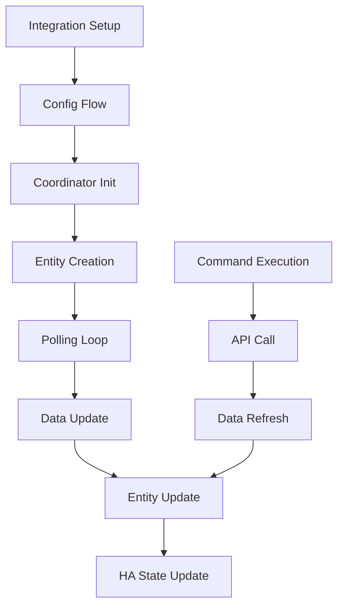

---

## 1. Integration Setup Workflow

**Entry Points**: `async_setup()` and `async_setup_entry()`

### Phase 1: Platform Setup (`async_setup`)

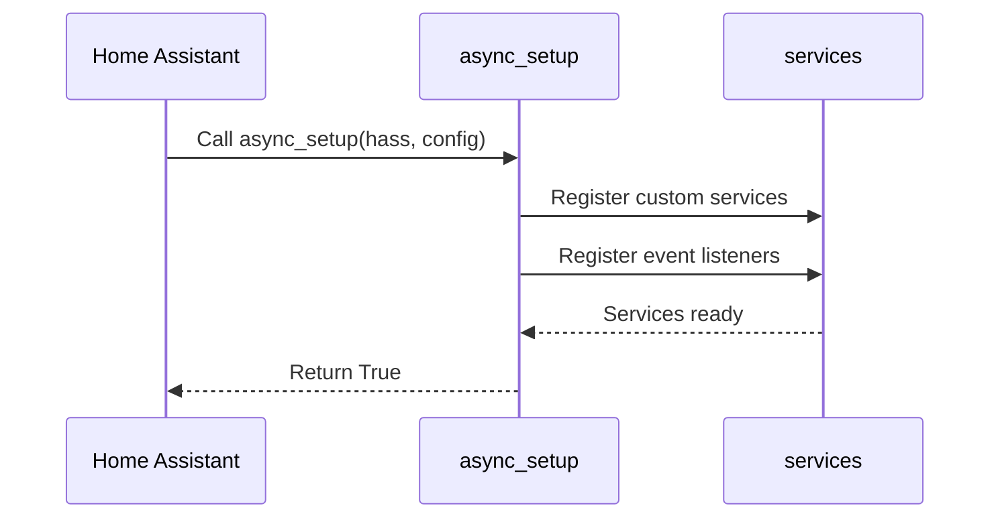

**Steps**:

1. Home Assistant calls `async_setup()` at startup
2. Register `tesla_custom.set_update_interval` service
3. Return True to confirm platform readiness

**Code Location**: `custom_components/tesla_custom/__init__.py::async_setup()`

### Phase 2: Config Entry Setup (`async_setup_entry`)

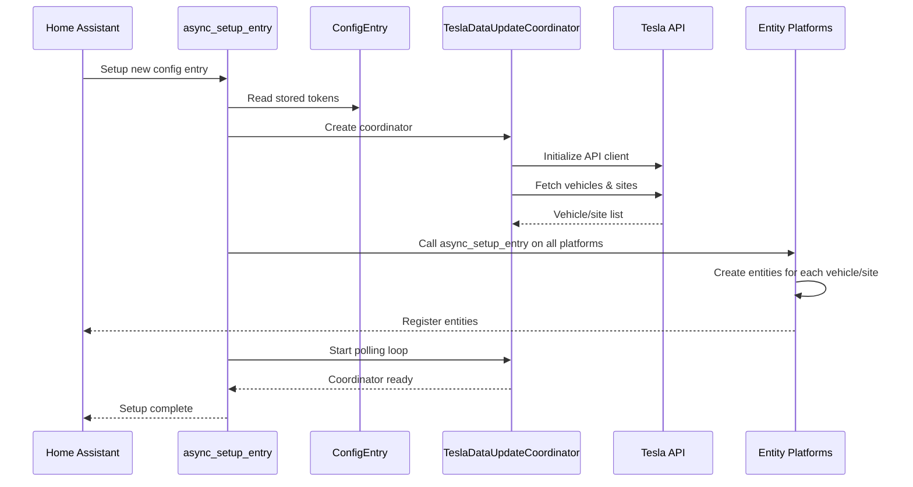

**Steps**:

1. Read OAuth tokens from config entry storage
2. Create `TeslaDataUpdateCoordinator` instance
3. Initialize Tesla API client
4. Fetch initial list of vehicles and energy sites
5. Create Home Assistant device entries for each vehicle/site
6. Call `async_setup_entry()` on all entity platforms (sensor, switch, etc.)
7. Each platform creates entities for its domain
8. Start polling loop with configured interval
9. Return True to confirm setup

**Code Location**: `custom_components/tesla_custom/__init__.py::async_setup_entry()`

**Home Assistant Integration Points**:

- Config entry stored at: `hass.data[DOMAIN][config_entry.entry_id]`
- Device registry: `hass.data["device_registry"]`
- Entity registry: `hass.data["entity_registry"]`

---

## 2. Configuration Flow Workflow

**File**: `custom_components/tesla_custom/config_flow.py`

### Config Flow Steps

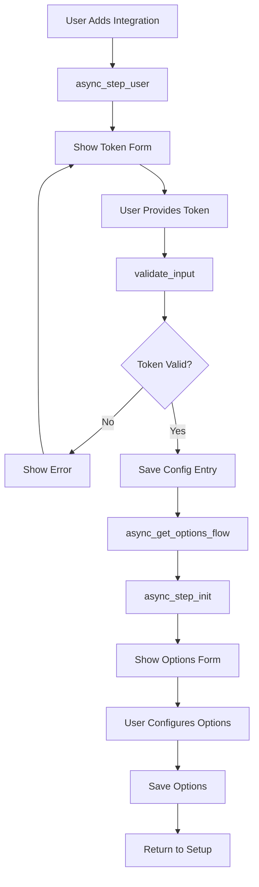

### Step 1: User Input (`async_step_user`)

**Triggered**: User selects "Add Integration" → "Tesla Custom"

**Process**:

1. Show form requesting Tesla refresh token
2. User provides token (from phone app or web generator)
3. Call `validate_input()` with token
4. If valid, create config entry
5. Redirect to options flow

**Form Fields**:

- `token`: Text field for Tesla refresh token

### Step 2: Validation (`validate_input`)

**Input**: `{CONF_TOKEN: "..."}`

**Process**:

1. Create temporary Tesla API client
2. Authenticate with provided token
3. Call `get_vehicles()` to verify token works
4. Return account info on success
5. Raise `InvalidAuth` or `CannotConnect` on failure

**Validation Checks**:

- Token format valid
- API endpoint reachable
- Token accepted by Tesla API
- Account has at least one vehicle or site

### Step 3: Options Configuration (`async_step_init` in OptionsFlowHandler)

**Triggered**: After config entry created

**Process**:

1. Show form with options fields
2. User configures:
   - `polling_interval`: 60-3600 seconds
   - `wake_on_start`: Wake vehicles on HA startup
   - `polling_policy`: Sleep/polling strategy
   - `teslamate_enabled`: Enable MQTT sync

**Default Values**:

```python
polling_interval: 660
wake_on_start: False
polling_policy: "polling_policy_always"
teslamate_enabled: False
```

### Step 4: Reauthentication (`async_step_reauth`)

**Triggered**: Token expires or becomes invalid

**Process**:

1. Detect auth error in polling loop
2. Call `async_step_reauth()`
3. Show "reauthenticate" form
4. User provides new token
5. Validate and update stored token
6. Resume polling

---

## 3. Data Polling Workflow

**Component**: `TeslaDataUpdateCoordinator`

### Polling Loop

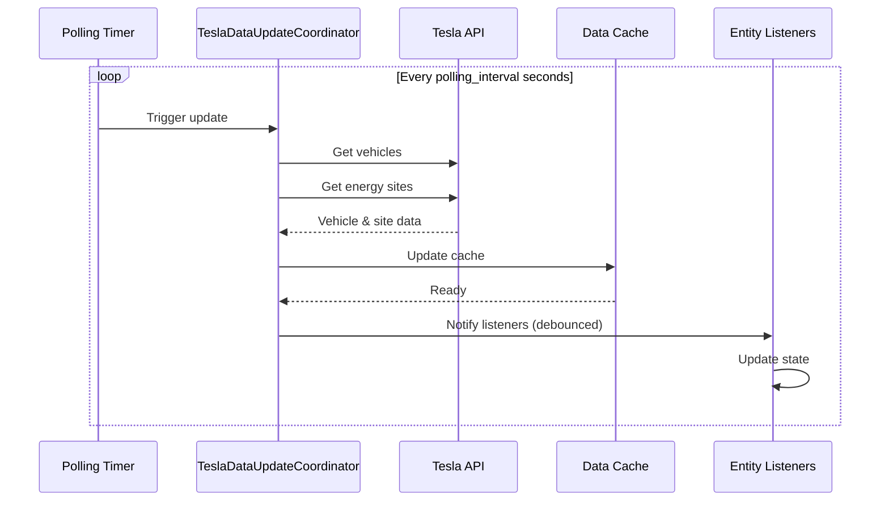

### Update Process (`_async_update_data`)

**Called**: Every `polling_interval` seconds by DataUpdateCoordinator

**Steps**:

1. Check if token refresh needed
2. Call `_async_update_vehicles()`
   - For each vehicle, get latest state via API
   - Cache response with vehicle ID
3. Call function to get energy sites
   - For each site, get latest state via API
   - Cache response with site ID
4. Return data dict with updated vehicles/sites

**Error Handling**:

- On API error: Log error, return cached data
- On auth error: Call `_async_save_tokens()` to refresh token
- On repeated errors: Implement exponential backoff

**Debouncing**:

- `async_update_listeners_debounced()` called after update
- Debounce window: 5 seconds (prevents rapid updates)
- Only notifies if data actually changed

### Listener Notification

```python
# Entities subscribe to coordinator updates
@callback
def _handle_coordinator_update(self) -> None:
    """Called when coordinator data changes"""
    # Read new data from coordinator
    new_value = self.vehicle["response"]["charge_state"]["battery_level"]
    # Write to Home Assistant state
    self.async_write_ha_state()
```

---

## 4. Entity Creation Workflow

**Triggered**: During `async_setup_entry()` for each platform

### Entity Creation Process

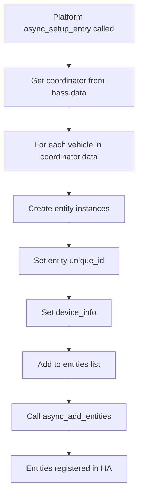

### Example: Sensor Platform

```python
async def async_setup_entry(hass, config_entry, async_add_entities, discovery_info):
    # Get coordinator
    coordinator = hass.data[DOMAIN][config_entry.entry_id]["coordinator"]

    entities = []

    # Create entities for each vehicle
    for vehicle_id in coordinator.data.get("vehicles", []):
        # Create battery sensor
        entities.append(TeslaCarBattery(coordinator, vehicle_id))
        # Create range sensor
        entities.append(TeslaCarRange(coordinator, vehicle_id))
        # Create temperature sensor
        entities.append(TeslaCarTemp(coordinator, vehicle_id))
        # ... more entities

    # Create entities for each energy site
    for site_id in coordinator.data.get("energy_sites", []):
        entities.append(TeslaEnergyBattery(coordinator, site_id))
        # ... more energy entities

    # Register with Home Assistant
    async_add_entities(entities)
```

### Entity Initialization

**In Entity `__init__`**:

```python
class TeslaCarBattery(TeslaCarEntity, SensorEntity):
    def __init__(self, coordinator, vehicle_id):
        super().__init__(coordinator, vehicle_id)
        # Set unique_id for registry
        self._attr_unique_id = f"{vehicle_id}_battery"
        # Set translation key for i18n
        self.entity_description = SensorEntityDescription(
            key="battery",
            name="Battery Level",
        )
```

### Device Registration

Each entity registers itself with a device via `device_info`:

```python
@property
def device_info(self) -> DeviceInfo:
    return DeviceInfo(
        identifiers={(DOMAIN, self.vin)},
        manufacturer="Tesla",
        model=self.vehicle["response"].get("model", "Unknown"),
        name=self.car_name,
        via_device=(DOMAIN, self.coordinator.unique_id),
    )
```

---

## 5. Command Execution Workflow

**Triggered**: User action in Home Assistant UI

### Lock/Unlock Workflow

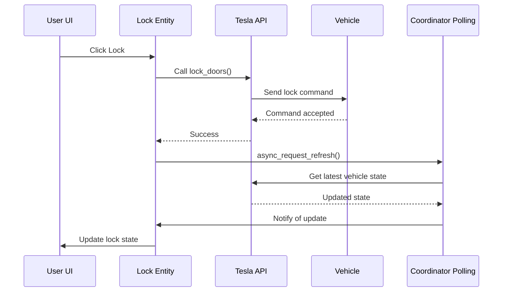

### Climate Control Workflow

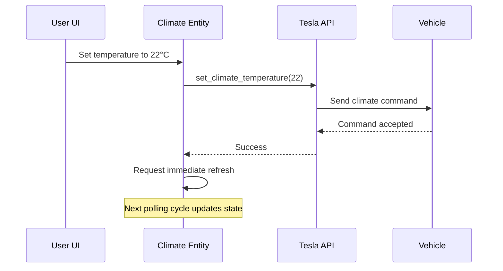

### Generic Command Flow

**In Entity Method**:

```python
async def async_lock(self):
    # 1. Call Tesla API command
    result = await self.coordinator.api.lock_doors()

    # 2. Check success
    if result:
        # 3. Request fresh data from polling
        await self.coordinator.async_request_refresh()
    else:
        raise HomeAssistantError("Failed to lock doors")
```

**Steps**:

1. Call Tesla API method via `coordinator.api`
2. Tesla API wakes vehicle if sleeping (automatic)
3. Command executed on vehicle
4. Response returned to entity
5. Entity calls `async_request_refresh()` to force update
6. Coordinator fetches latest state
7. All listening entities notified
8. Entity state updates in Home Assistant

---

## 6. TeslaMate MQTT Sync Workflow

**File**: `custom_components/tesla_custom/teslamate.py`  
**Enabled**: Via config option `teslamate_enabled: True`

### Enable Process

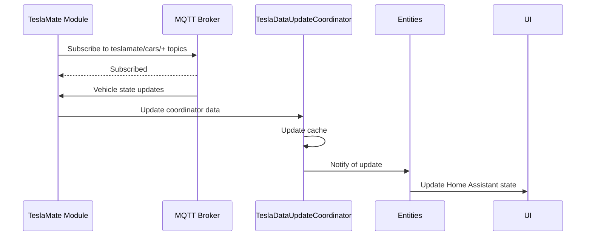

### Data Flow

**Topics Listened To**:

```
teslamate/cars/{car_id}/state
teslamate/cars/{car_id}/charge_state
teslamate/cars/{car_id}/latitude
teslamate/cars/{car_id}/longitude
teslamate/cars/{car_id}/battery_level
teslamate/cars/{car_id}/inside_temp
teslamate/cars/{car_id}/outside_temp
... and more
```

**Transformation**:

1. MQTT message received on topic
2. Extract metric name and value
3. Map to vehicle state field
4. Update coordinator cache
5. Notify listeners

**Benefits vs Polling**:

- Real-time updates (no polling delay)
- Reduced battery drain (vehicle data already collected)
- Works with TeslaMate instance running separately

---

## 7. Device Removal Workflow

**Triggered**: User removes device from Home Assistant entity registry

### Removal Process

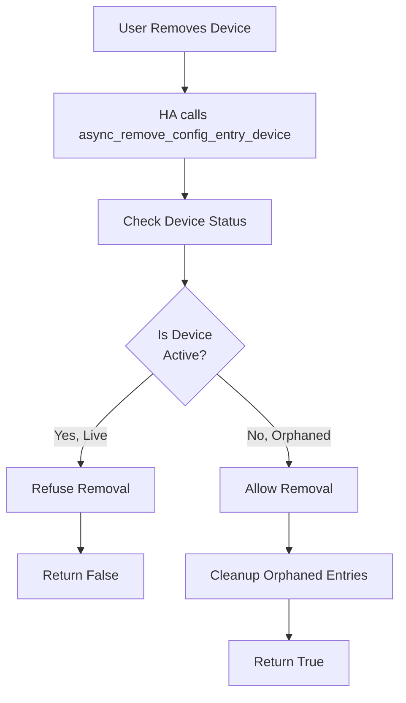

**Check Logic**:

```python
async def async_remove_config_entry_device(config_entry, device_entry):
    # Check if device is a live vehicle
    for vehicle_id, vehicle in coordinator.data["vehicles"].items():
        if device_entry.name == vehicle.get("display_name"):
            return False  # Can't remove live vehicle

    # Check if device is a live site
    for site_id, site in coordinator.data["energy_sites"].items():
        if device_entry.name == site.get("name"):
            return False  # Can't remove live site

    # Device is orphaned, safe to remove
    return True
```

---

## 8. Error Recovery Workflow

### API Error Handling

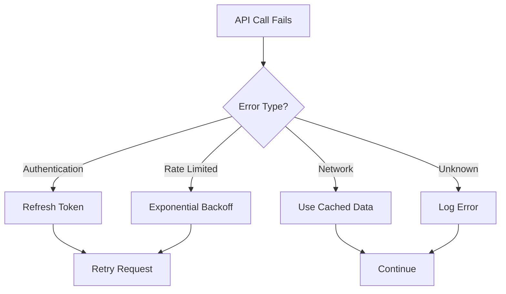

### Token Refresh Process

**Triggered**: Auth error during polling

```python
async def _async_update_data(self):
    try:
        return await self._fetch_data()
    except Unauthorized:
        # Token expired, refresh it
        await self._async_save_tokens()
        # Retry fetch
        return await self._fetch_data()
```

### Backoff Strategy

```python
# Exponential backoff on transient errors
attempt = 0
while attempt < max_retries:
    try:
        result = await api_call()
        break
    except TransientError:
        wait_time = 2 ** attempt  # 1s, 2s, 4s, 8s...
        await asyncio.sleep(wait_time)
        attempt += 1
```

---

## 9. Shutdown & Cleanup Workflow

**Triggered**: Home Assistant shutdown or integration unload

### Unload Process

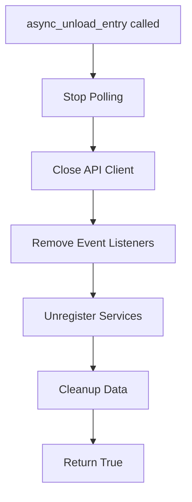

**Steps**:

```python
async def async_unload_entry(hass, config_entry):
    # Stop polling and close coordinator
    await hass.data[DOMAIN][config_entry.entry_id]["coordinator"].async_shutdown()

    # Close API client
    await hass.data[DOMAIN][config_entry.entry_id]["api"].close()

    # Unload all platforms
    unload_ok = await hass.config_entries.async_unload_platforms(
        config_entry, PLATFORMS
    )

    # Remove data
    if unload_ok:
        hass.data[DOMAIN].pop(config_entry.entry_id)

    return unload_ok
```

---

## 10. Vehicle Sleep & Wake Logic

### Sleep State Detection

```python
# During polling, check vehicle state
vehicle_state = await api.get_vehicle(vehicle_id)
if vehicle_state["state"] == "asleep":
    # Don't request data for this vehicle
    skip_polling(vehicle_id)
elif vehicle_state["state"] == "online":
    # Vehicle awake, get full data
    fetch_full_vehicle_data(vehicle_id)
```

### Wake-Up Trigger

Vehicles wake automatically when:

- Commands sent (lock, climate, etc.)
- User manually wakes via Tesla app
- Scheduled wake (if configured)

Integration respects wake by:

- Not sending commands to asleep vehicles
- Polling after command (expects vehicle to be awake)
- Continuing without error if vehicle doesn't wake

### Polling Policy Application

**Policy: `polling_policy_conserve`**

- Skip polling for offline/asleep vehicles
- Only poll online vehicles
- Minimize API calls

**Policy: `polling_policy_always`**

- Poll all vehicles regardless of state
- Detects vehicle transitions (online ↔ asleep)

---

**Summary**: Workflows follow async patterns, implement proper error handling, respect vehicle sleep states, and integrate cleanly with Home Assistant's entity framework and lifecycle management.
